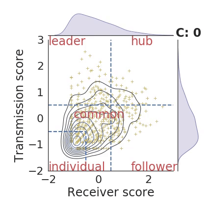

# 
 Emergence of synchronized multicellular mechanosensing from spatiotemporal integration of heterogeneous single-cell information transfer 

#

    

 Amos Zamir1, Guanyu Li2,3, Katelyn Chase3, Robert Moskovitch1, Bo Sun2§, Assaf Zaritsky1§

1Department of Software and Information Systems Engineering, Ben-Gurion University of the Negev, Beer-Sheva 84105, Israel  
2Department of Physics, Oregon State University, Corvallis, OR 97331, USA  
3Lewis-Sigler Institute for Integrative Genomics, Princeton University, Princeton, NJ 08544, USA  
§ Corresponding author.  
Assaf Zaritsky, assafza@bgu.ac.il  
Bo Sun, sunb@physics.oregonstate.edu 

#

    

## Repository Contents
- Experiment data of one of the cyclic expirments tag by 05_08. (/data)
- The code base used for the study analysis.
- A notebook example which used to investigate the expirment of 05_08. (/notebooks)
- Scripts for setup the enviroments

# Setup & Running Source Code
## Prerequisite
- conda 4.8.3
- vscode or Jupyter
- Ubuntun-18.04 (should be compatiable to Windows but not tested)

## How to run?
1. running bash command to install the conda env - ./install_env.sh
2. activate the environment
3. running jupyter/vscode using this enviroment.

Please contact zamiramos@gmail.com or assafzar@gmail.com for bugs or questions.

